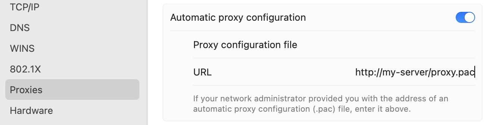

# Disclaimer

**This package is not related to or developed by Mullvad. No relationship between the developer of this package and Mullvad exists.**

**All trademarks, logos and brand names are the property of their respective owners. All company, product and service names used in this package are for identification purposes only. Use of these names,trademarks and brands does not imply endorsement.**


# xbar Mullvad Wireguard SOCKS5 proxy switcher

This [xbar](https://github.com/matryer/xbar) plugin let's you switch between Mullvad WireGuard proxies.
It is especially useful if you got a Mullvad configured on your router.

## Install

Download the shell script:

```Shell
wget -qo "~/Library/Application Support/xbar/plugins/mullvad-wireguard.1h.sh" https://raw.githubusercontent.com/mietzen/xbar-mullvad-wireguard-proxy-plugin/main/mullvad-wireguard.1h.sh
```

On the initial start the a `venv` will created and the remaining assets are loaded.

## Usage


It can also be used to set Proxy Auto-Config via a URL, you can either create a file in `~/Library/Application\ Support/xbar/plugins/mullvad-wireguard-proxy/.pac_url` with your URL or set the URL manually via system settings.



The plugin will automatically set the proxy bypass domains, including you current local network and search domain:

```Shell
$ networksetup -getproxybypassdomains Wi-Fi
127.0.0.1/8
169.254.0.0/16
192.168.178.0/24
localhost
*.local
*.box
```
